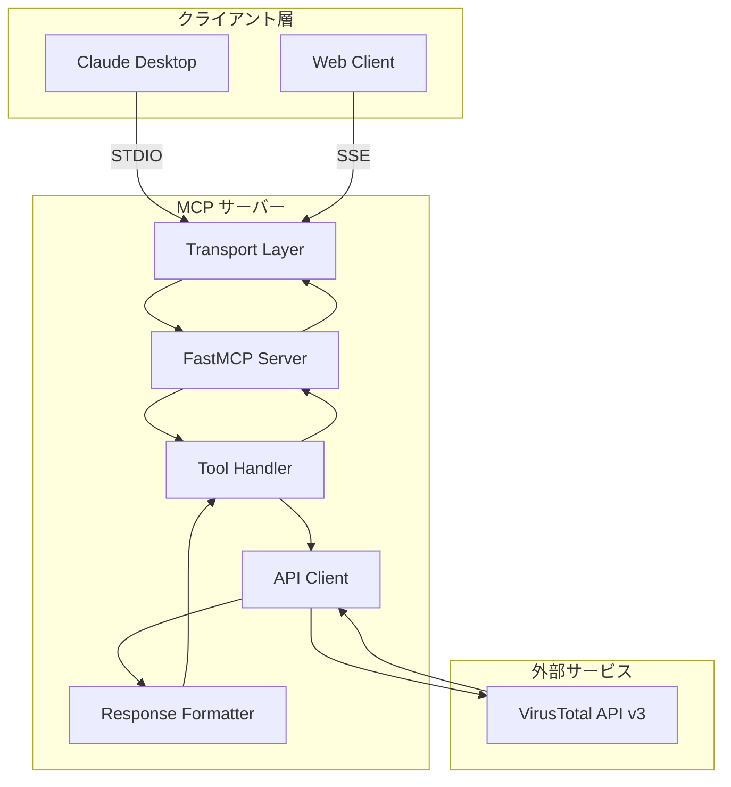

# 設計文書

## 概要

VirusTotal MCPサーバーは、VirusTotal API v3を活用してセキュリティ分析機能を提供するModel Context Protocol (MCP) サーバーです。FastMCPフレームワークを使用してPythonで実装され、AIアシスタント（Claude等）に対して8つの包括的なセキュリティ分析ツールを提供します。

本システムは、URL、ファイル、IPアドレス、ドメインの脅威分析を行い、関連する脅威インテリジェンス情報を自動的に収集して構造化されたレポートとして提供します。

## アーキテクチャ

### システム構成図



### アーキテクチャの特徴

- **レイヤード アーキテクチャ**: 明確な責任分離により保守性を確保
- **非同期処理**: httpxとasyncioを使用した効率的なAPI呼び出し
- **マルチトランスポート**: STDIO、SSE、StreamableHTTPの3つをサポート
- **エラー分離**: 各レイヤーで適切なエラーハンドリング

## コンポーネントと インターフェース

### 1. FastMCP Server コンポーネント

**責任**: MCPプロトコルの実装とツール管理

**主要クラス**:
```python
class FastMCP:
    def __init__(self, name: str)
    def tool(self) -> Decorator  # ツール登録デコレータ
    def run(self, transport: str, host: str = None, port: int = None)
```

**インターフェース**:
- MCPクライアントとの通信
- ツール呼び出しのルーティング
- トランスポート層の管理

### 2. VirusTotal API Client コンポーネント

**責任**: VirusTotal API v3との通信

**主要関数**:
```python
async def query_virustotal(
    endpoint: str, 
    method: str = "GET", 
    data: Optional[Dict] = None
) -> Dict[str, Any]

def encode_url_for_vt(url: str) -> str
```

**設定**:
- ベースURL: `https://www.virustotal.com/api/v3`
- 認証: `x-apikey` ヘッダー
- タイムアウト: 30秒
- HTTPクライアント: httpx.AsyncClient

### 3. Security Analysis Tools コンポーネント

**責任**: セキュリティ分析ツールの実装

**ツール一覧**:

#### レポートツール（自動関係データ取得付き）
1. `get_url_report(url: str) -> str`
2. `get_file_report(file_hash: str) -> str`
3. `get_ip_report(ip: str) -> str`
4. `get_domain_report(domain: str, relationships: Optional[List[str]]) -> str`

#### 関係データツール（ページネーション対応）
5. `get_url_relationship(url: str, relationship: str, limit: int, cursor: Optional[str]) -> str`
6. `get_file_relationship(file_hash: str, relationship: str, limit: int, cursor: Optional[str]) -> str`
7. `get_ip_relationship(ip: str, relationship: str, limit: int, cursor: Optional[str]) -> str`
8. `get_domain_relationship(domain: str, relationship: str, limit: int, cursor: Optional[str]) -> str`

### 4. Response Formatter コンポーネント

**責任**: API レスポンスの構造化とフォーマット

**主要関数**:
```python
def format_scan_results(data: Dict[str, Any], scan_type: str) -> str
def format_relationship_item(item: Dict[str, Any]) -> str
```

**出力形式**:
- マークダウン形式のレポート
- 検出統計の構造化表示
- 関係データの階層表示

### 5. Configuration Manager コンポーネント

**責任**: 環境設定と設定値の管理

**設定項目**:
```python
API_KEY = os.getenv("VIRUSTOTAL_API_KEY")  # 必須
MCP_TRANSPORT = os.getenv("MCP_TRANSPORT", "sse")  # オプション: stdio, sse, streamable-http
MCP_HOST = os.getenv("MCP_HOST", "0.0.0.0")  # オプション: ホストアドレス
MCP_PORT = os.getenv("MCP_PORT", "8000")  # オプション: ポート番号
VT_BASE_URL = "https://www.virustotal.com/api/v3"  # 固定
```

## データモデル

### 1. VirusTotal API レスポンス モデル

```python
# 基本レスポンス構造
class VTResponse:
    data: Dict[str, Any]
    meta: Optional[Dict[str, Any]]
    links: Optional[Dict[str, Any]]

# 分析結果属性
class AnalysisAttributes:
    last_analysis_stats: Dict[str, int]  # 検出統計
    last_analysis_date: int
    reputation: int
    # その他の属性は分析タイプにより異なる

# 関係データ
class RelationshipData:
    data: List[Dict[str, Any]]
    links: Optional[Dict[str, Any]]
    meta: Optional[Dict[str, Any]]
```

### 2. 内部データ構造

```python
# 統合レポートデータ
class SecurityReport:
    attributes: AnalysisAttributes
    relationships: Dict[str, RelationshipData]
    target: str  # 分析対象（URL、ハッシュ、IP、ドメイン）
    scan_type: str  # "URL", "File", "IP", "Domain"

# 関係項目
class RelationshipItem:
    type: str  # "domain", "ip_address", "file", "url"
    id: str
    attributes: Optional[Dict[str, Any]]
```

### 3. 設定データ

```python
# デフォルト関係タイプ
DEFAULT_RELATIONSHIPS = {
    "url": [
        "communicating_files",
        "contacted_domains", 
        "contacted_ips",
        "downloaded_files",
        "redirects_to",
        "related_threat_actors"
    ],
    "file": [
        "behaviours",
        "dropped_files",
        "contacted_domains",
        "contacted_ips", 
        "embedded_urls",
        "related_threat_actors"
    ],
    "ip": [
        "communicating_files",
        "historical_ssl_certificates",
        "resolutions",
        "related_threat_actors"
    ],
    "domain": [
        "subdomains",
        "historical_ssl_certificates", 
        "resolutions",
        "related_threat_actors"
    ]
}
```

## 正確性プロパティ

*プロパティとは、システムの全ての有効な実行において真であるべき特性や動作のことです。プロパティは、人間が読める仕様と機械で検証可能な正確性保証の橋渡しとなる正式な記述です。*

### プロパティ 1: URL分析の包括性
*任意の*有効なURLに対して、URL分析を実行すると、検出統計（悪意のある、疑わしい、クリーン、未検出）と指定された関係データ（関連ファイル、接触ドメイン、接触IP、ダウンロードファイル、リダイレクト先、関連脅威アクター）を含む構造化されたマークダウンレポートが返される
**検証対象: 要件 1.1, 1.2, 1.3**

### プロパティ 2: ファイル分析の包括性
*任意の*有効なファイルハッシュ（MD5、SHA-1、SHA-256）に対して、ファイル分析を実行すると、検出統計と指定された関係データ（動作、ドロップファイル、接触ドメイン、接触IP、埋め込みURL、関連脅威アクター）を含む構造化されたマークダウンレポートが返される
**検証対象: 要件 2.1, 2.2, 2.4**

### プロパティ 3: IP分析の包括性
*任意の*有効なIPアドレス（IPv4またはIPv6）に対して、IP分析を実行すると、検出統計と指定された関係データ（通信ファイル、履歴SSL証明書、解決履歴、関連脅威アクター）を含む構造化されたマークダウンレポートが返される
**検証対象: 要件 3.1, 3.2, 3.4**

### プロパティ 4: ドメイン分析の包括性
*任意の*有効なドメイン名に対して、ドメイン分析を実行すると、検出統計と指定された関係データ（サブドメイン、履歴SSL証明書、解決履歴、関連脅威アクター）を含む構造化されたマークダウンレポートが返される
**検証対象: 要件 4.1, 4.2**

### プロパティ 5: 関係データフィルタリング
*任意の*ドメイン分析において、特定の関係タイプが指定された場合、返されるレポートには指定された関係データのみが含まれ、他の関係データは含まれない
**検証対象: 要件 4.3**

### プロパティ 6: 関係データクエリの正確性
*任意の*分析対象（URL、ファイル、IP、ドメイン）と有効な関係タイプの組み合わせに対して、関係データクエリを実行すると、該当する関係データが返される
**検証対象: 要件 5.1**

### プロパティ 7: ページネーション制限の遵守
*任意の*関係データクエリにおいて、limitパラメータ（1-40の範囲）が指定された場合、返される結果の数は指定されたlimit値以下である
**検証対象: 要件 5.2**

### プロパティ 8: ページネーション継続の正確性
*任意の*関係データクエリにおいて、有効なcursorパラメータが指定された場合、前回のクエリの続きのデータが返される
**検証対象: 要件 5.3**

### プロパティ 9: API認証ヘッダーの包含
*任意の*VirusTotal APIリクエストにおいて、リクエストヘッダーには有効なAPIキーが`x-apikey`として含まれている
**検証対象: 要件 6.3**

### プロパティ 10: 無効入力のエラーハンドリング
*任意の*無効な入力（無効なURL、存在しないハッシュ、無効なIPアドレス、無効なドメイン名、存在しない関係タイプ）に対して、適切なエラーメッセージが返される
**検証対象: 要件 1.4, 2.3, 3.3, 4.4, 5.4**

### プロパティ 11: HTTPエラーの適切な処理
*任意の*HTTPエラー（レート制限、ネットワークエラー、無効なレスポンス、認証エラー）が発生した場合、ユーザーフレンドリーなエラーメッセージが返される
**検証対象: 要件 7.1, 7.2, 7.3, 7.4**

### プロパティ 12: レポート形式の一貫性
*任意の*分析結果において、返されるレポートはマークダウン形式で構造化されており、検出統計は4つのカテゴリ（悪意のある、疑わしい、クリーン、未検出）を含み、関係データは各タイプごとに項目数と詳細リストを含み、各関係項目は項目タイプに応じた適切な形式で表示される
**検証対象: 要件 9.1, 9.2, 9.3, 9.4**

### プロパティ 13: 部分的エラーでの継続処理
*任意の*複数の関係データを取得する分析において、一部の関係データの取得でエラーが発生した場合でも、他の関係データは正常に取得され、レポートに含まれる
**検証対象: 要件 10.4**

## エラーハンドリング

### エラー分類と処理戦略

#### 1. 入力検証エラー
- **発生条件**: 無効なURL、ハッシュ、IP、ドメイン形式
- **処理方法**: 入力検証後、即座にエラーメッセージを返す
- **エラー形式**: `ValueError` with descriptive message

#### 2. API認証エラー
- **発生条件**: 無効または未設定のAPIキー
- **処理方法**: 起動時チェック（未設定）、実行時エラーハンドリング（無効）
- **エラー形式**: `ValueError` for missing key, HTTP 401/403 handling

#### 3. VirusTotal APIエラー
- **発生条件**: レート制限、サーバーエラー、存在しないリソース
- **処理方法**: HTTPステータスコードに基づく分岐処理
- **エラー形式**: `httpx.HTTPError` → `ValueError` with user-friendly message

#### 4. ネットワークエラー
- **発生条件**: タイムアウト、接続エラー
- **処理方法**: 30秒タイムアウト設定、適切なエラーメッセージ
- **エラー形式**: `httpx.TimeoutException` → `ValueError`

#### 5. 部分的エラー
- **発生条件**: 関係データの一部取得に失敗
- **処理方法**: エラーをログ記録し、取得可能なデータで継続
- **エラー形式**: 個別の関係データ取得エラーは無視、メインデータは返す

### エラーメッセージ設計

```python
ERROR_MESSAGES = {
    "invalid_url": "提供されたURLの形式が無効です: {url}",
    "invalid_hash": "提供されたハッシュの形式が無効です: {hash}",
    "invalid_ip": "提供されたIPアドレスの形式が無効です: {ip}",
    "invalid_domain": "提供されたドメイン名の形式が無効です: {domain}",
    "missing_api_key": "VIRUSTOTAL_API_KEY環境変数が設定されていません",
    "api_auth_error": "VirusTotal API認証に失敗しました",
    "rate_limit": "VirusTotal APIのレート制限に達しました。しばらく待ってから再試行してください",
    "network_error": "ネットワークエラーが発生しました: {error}",
    "api_error": "VirusTotal APIエラー: {error}",
    "invalid_relationship": "無効な関係タイプです: {relationship}"
}
```

## テスト戦略

### デュアルテストアプローチ

本システムでは、包括的なカバレッジを確保するため、ユニットテストとプロパティベーステストの両方を実装します：

- **ユニットテスト**: 特定の例、エッジケース、エラー条件を検証
- **プロパティテスト**: 全入力に対する普遍的なプロパティを検証

### プロパティベーステスト設定

**使用ライブラリ**: Hypothesis (Python)
**設定**:
- 最小実行回数: 100回（ランダム化による）
- 各プロパティテストは設計文書のプロパティを参照
- タグ形式: **Feature: virustotal-mcp-server, Property {number}: {property_text}**

### テスト分類

#### ユニットテスト対象
- 設定読み込み機能（APIキー検証）
- トランスポート選択ロジック
- エラーメッセージ生成
- URL エンコーディング機能
- レスポンスフォーマット機能
- 特定のエラーケース（認証エラー、レート制限等）

#### プロパティテスト対象
- 全ての分析ツールの包括性（プロパティ1-4）
- 関係データフィルタリング（プロパティ5）
- 関係データクエリ（プロパティ6-8）
- API認証ヘッダー（プロパティ9）
- エラーハンドリング（プロパティ10-11）
- レポート形式（プロパティ12）
- 部分的エラー処理（プロパティ13）

### テストデータ生成戦略

#### 有効データ生成
```python
# URL生成: http/https + 有効ドメイン + パス
# ハッシュ生成: MD5(32文字)、SHA-1(40文字)、SHA-256(64文字)の16進文字列
# IP生成: IPv4(0-255.0-255.0-255.0-255)、IPv6(有効な16進表記)
# ドメイン生成: 有効なドメイン名形式
```

#### 無効データ生成
```python
# 無効URL: 不正なスキーム、無効な文字、空文字列
# 無効ハッシュ: 不正な長さ、非16進文字、空文字列
# 無効IP: 範囲外の値、不正な形式、空文字列
# 無効ドメイン: 不正な文字、空文字列、長すぎる名前
```

### 統合テスト

#### Mock戦略
- VirusTotal APIレスポンスのモック化
- 様々なAPIレスポンス（成功、エラー、部分的失敗）のシミュレーション
- レート制限とネットワークエラーのシミュレーション

#### エンドツーエンドテスト
- 実際のVirusTotal APIを使用した統合テスト（CI/CD環境）
- 全ツールの動作確認
- トランスポート層の動作確認